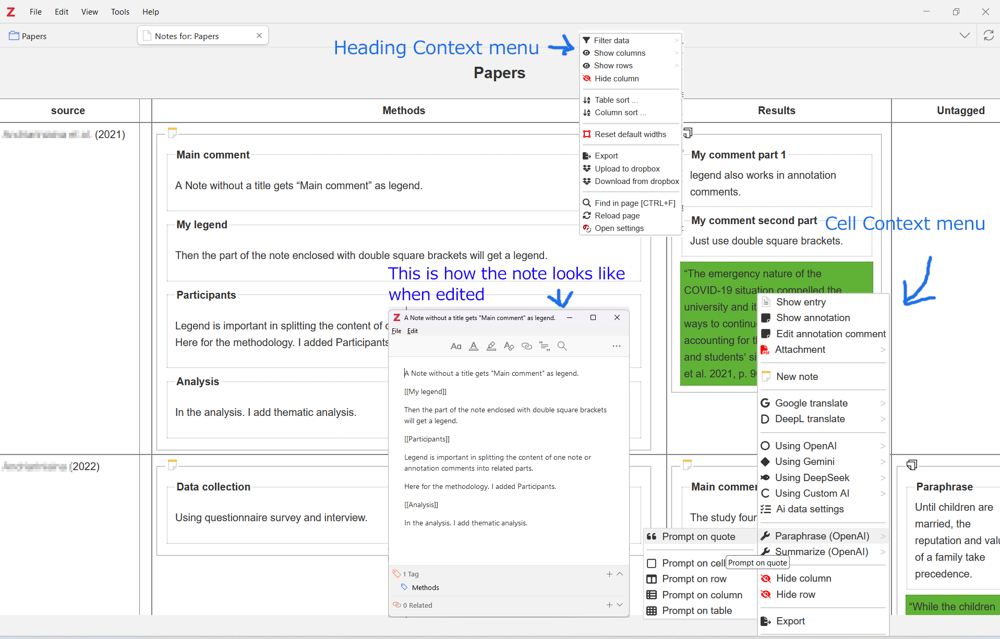

# Ze Notes version 1
The new version of Ze Notes is out. In order to make maintenance easier, the code was ported to NodeJS, using React. Version 1 only works with Zotero 7. Please read this document before installing.

## Description
Ze Notes is a Zotero plugin that will help you manage and visualize your notes and annotations in tables. It is helpfull if you intend to make a systematic review directly on your Zotero using notes and annotations from attachments. You can edit your notes right on the table or add new ones. 

A part from note management, other functionalities are also available. You can generate translations of your notes using Google or DeepL if you provide API keys. You can also apply a generative AI prompts such as Gemini, ChatGPT or DeepSeek. You can also add prompts from custom generative AI if you use other services that the above. Prompts can be applied to the table, a column, a row, a cell, or the part of a cell. Some of these actions will also be available right in the pdf reader of Zotero.

## Install
* Head to the release page: https://github.com/frianasoa/Ze-Notes/releases/
* Download the latest version of the ".xpi" file. Please right click and "save as" if your browser tries to install it and fail.
* Open your Zotero. On the menu, click “Tools → Add-Ons” to open a window.
* Drag the .xpi file for the plugin onto that window. 
* Alternatively, you can click on the clog on the top right corner, then click "Install Add-on From File", choose the file and open.
* Restart your Zotero.

Form more on Add-ons see this page https://www.zotero.org/support/plugins

## Get started
* In Zotero, keep your files in particular collections (folders) 
* Add notes to an item or annotations and annotation comments to a file of a particular collection. Add a tags to the notes or annotations. 
* Right click on the collection -> Show note.
* This will open a tab with a table containing a table with your notes.
* Right click on a cell, or a column heading to show a context menu. Cell context menu will mainly contain menus pertaining to the content while heading context menu will have menu to apply to the table in general. 
* You can manage your notes, annotations, and tags and more.
* You may set column width, hide/unhide columns/rows.
* When you finish, you may export as docx, xlsx, or other formats.
* For more information, please see the documentation

## Migrating to version 1
* A simple logic for migration was implemented. It will port your old settings to the new format automatically when you run version 1. Nevertheless, due to incompatibility and complexity, some settings will need to be set manually. If you are unable to do this, please stay on version 0.
 
* Ze Notes version 1 creates a database separate from Zotero to manage some settings, including your api keys and output format settings. Such settings will not sync between computers logged in with the same account. I am thinking of a way to encrypt+export/decrypt+import settings manually. This is already implemented for Dropbox settings export/import.

* ⚠️ Ze Notes version 1 uses a different key (password) to encrypt sensitive settings such as api keys. I will add the ability to customize this key in the future. 

* As your data (notes and annotations) reside in Zotero, they will not change.
* From version 1, Ze Notes will create document entries in Zotero to keep more complex data such as prompt results on columns or the entire table.

## Reduced functionality
There are functionalities that are not available in version 1. While some will be easy to implement. Others will be time consuming. If you rely on such functionalities, please downgrade to version 0 and request the feature through github issues.

## Documentation
For more information, check the documentation page below.\
https://frianasoa.github.io/Ze-Notes/