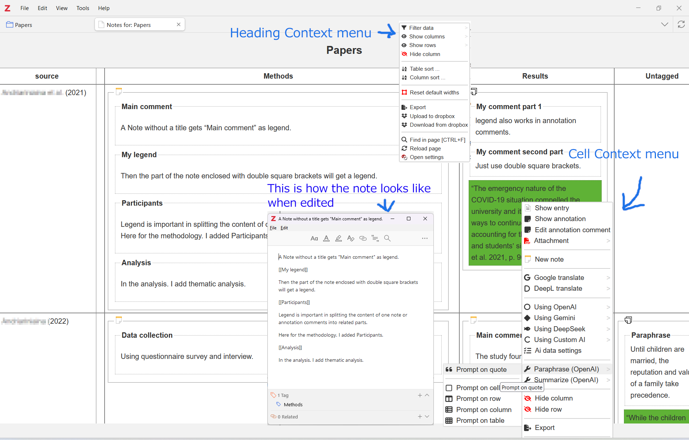
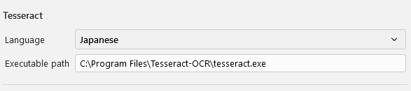

# Ze Notes

[日本語版 / Japanese version](README-JA.md)

A Zotero plugin that displays your notes and annotations in editable tables, for literature reviews done directly inside Zotero.

## Table of Contents

1. [What is Ze Notes?](#what-is-ze-notes)
2. [Prerequisites](#prerequisites)
3. [Installation](#installation)
4. [Getting Started](#getting-started)
5. [The Table](#the-table)
6. [Translation](#translation)
7. [Generative AI](#generative-ai)
8. [OCR with Tesseract](#ocr-with-tesseract)
9. [PDF Reader Integration](#pdf-reader-integration)
10. [Export](#export)
11. [Sharing with Dropbox](#sharing-with-dropbox)
12. [How Your Data Is Stored](#how-your-data-is-stored)
13. [Building from Source](#building-from-source)
14. [Getting Help](#getting-help)

---

## What is Ze Notes?

Ze Notes helps you manage and visualize your Zotero notes and annotations in tables. It is useful if you intend to make a systematic review directly in Zotero using notes and annotations from your attachments. Each collection gets its own table: rows are your items, columns are your tags, and cells hold the notes and annotations carrying those tags. You can edit notes right in the table or add new ones.

Your notes and annotations stay in Zotero. Ze Notes reads them, displays them, and writes your edits back through Zotero itself. There is no separate copy of your research data to maintain.

Beyond note management, the plugin can:

- Translate notes and annotations with Google or DeepL
- Run generative AI prompts on a cell, a row, a column, the whole table, or a selected part of a cell
- Turn images in your annotations and notes into text with Tesseract OCR, with optional AI correction of the result
- Export the table as DOCX, XLSX, XLS, HTML, or Markdown

Translation and AI also work from inside the Zotero PDF reader.

---

## Prerequisites

**Required:**

- Zotero 7, 8, or 9 (minimum 7.0.0-beta.70)

**Optional, depending on the features you want:**

- A [Tesseract](https://tesseract-ocr.github.io/tessdoc/Downloads.html) installation for OCR
- API keys for the translation and AI services you plan to use (DeepL, OpenAI, Gemini, DeepSeek, Claude, or a custom provider).

---

## Installation

1. Go to the release page: https://github.com/frianasoa/Ze-Notes/releases/
2. Download the latest `.xpi` file. If your browser tries to install it and fails, right-click the link and choose "Save as".
3. In Zotero, open "Tools → Add-ons" (or "Plugins", depending on your Zotero version).
4. Drag the `.xpi` file onto that window. Alternatively, click the gear icon in the top right corner, choose "Install Add-on From File", and select the file.
5. Restart Zotero.

For more on Zotero plugins in general, see https://www.zotero.org/support/plugins

---

## Getting Started

1. In Zotero, keep your files in collections (folders).
2. Add notes to an item, or annotations and annotation comments to an attached file. Add tags to the notes or annotations. The tags become your table columns.
3. Right-click the collection and choose "Show notes". The same action is available under "Tools → Ze Notes → Show notes", and it also works with a group or a whole library selected.
4. A tab opens with a table containing your notes and annotations.



Two context menus do most of the work:

- **Cell context menu.** Right-click a cell for actions on its content: show the entry, edit the note, edit the annotation comment, create or delete a note, translate, run an AI prompt, OCR an image, show the attached file.
- **Heading context menu.** Right-click a column heading for actions on the table in general: sorting, hiding and showing columns and rows, export, Dropbox, settings.

Settings are available under "Edit → Settings" or "Tools → Ze Notes → Show settings", and from the heading context menu.

---

## The Table

**Editing.** Edit notes and annotation comments directly in the table. You can also create new notes from the cell context menu and delete the ones you no longer need.

**Layout.** Drag columns to reorder them, resize column widths, and hide or unhide columns and rows. Hidden rows and columns are remembered per collection. A "Reset default widths" action in the heading context menu restores the original column widths. Notes and annotations without tags go to an "Untagged" column, and you can change that label in the settings.

**Filtering.** The "Filter data" entry in the heading context menu switches the table between showing all items, tagged items only, or untagged items only.

**Sorting.** Sort by column, ascending or descending, and combine several columns through the table sort dialog. A "legacy display" option in the table display settings restores the layout of the previous version, and you can keep the column sorter always visible if you prefer.

**Appearance.** Set a background color and a text color per column, and add a prefix or suffix to column headings.

**Search.** A find bar lets you search the table text.

**Keyboard shortcuts:**

| Shortcut | Action |
|----------|--------|
| Ctrl+F | Open the find bar |
| Enter / F3 | Next match |
| Shift+Enter / Shift+F3 | Previous match |
| Escape | Close the find bar |
| Ctrl+Plus | Zoom in |
| Ctrl+Minus | Zoom out |

---

## Translation

Ze Notes can translate notes, annotations, and annotation comments with two services:

- **Google Translate.** Works without a key. If you provide a Cloud Translation API key in the settings, the plugin uses it; otherwise it falls back to the free endpoint.
- **DeepL.** Requires a DeepL API key.

Set the target language and any keys in the settings. Once configured, the translation actions appear in the context menu of the table and in the PDF reader.

---

## Generative AI

You can run AI prompts on your notes and annotations. A prompt can target a single cell, a row, a column, the entire table, or just the part of a cell you selected. Each provider's actions appear in the context menu once its API key is set.

An "Ai data settings" dialog, available next to the AI actions in the context menu, lets you choose which parts of your data (quotes, sources, author, and the individual tags and annotation parts) are included in what is sent to the AI. The selection is remembered per collection.

**Built-in providers:**

| Provider | Configuration |
|----------|---------------|
| OpenAI | API key, model, max tokens |
| Gemini | API key, model |
| DeepSeek | API key, model |
| Claude (Anthropic) | API key, model, max tokens |
| Custom AI | URL, API key, model, request options, response format function |

Each provider takes a system message and a user prompt, which you can adjust until you are satisfied with the results.

**Custom AI.** If you use a service other than the ones above, or want several ready-made prompts for the same service, the Custom AI settings let you describe the request yourself: the endpoint URL, the request options as JSON with `${variable}` placeholders, and a small function that extracts the result from the response. You can save multiple configurations and choose which ones appear in the context menu; up to 20 are shown at a time. See the [documentation](https://frianasoa.github.io/Ze-Notes/) for a working example.

**A note on keys and cost.** API keys are stored locally in an encrypted database on your machine. Usage is billed by the provider, not by Ze Notes, so keep an eye on your provider dashboard and set spending limits there.

---

## OCR with Tesseract

If Tesseract is installed on your machine, Ze Notes can turn images in your annotations and notes into text.

1. Install Tesseract: https://tesseract-ocr.github.io/tessdoc/Downloads.html
2. Ze Notes looks for the Tesseract executable in the usual locations on Windows, Linux, and macOS. If you installed it somewhere else, set the path in the settings.
3. Choose the recognition language from the available language list.

An OCR action then appears in the context menu for annotation images and note images.

**AI correction.** OCR output is rarely perfect. You can pipe the result through any of your configured AI providers, which fixes recognition errors while keeping the original language and structure of the text.



---

## PDF Reader Integration

Some actions are available directly in the Zotero PDF reader, from the context menu on highlighted text:

- Translate the highlight with Google or DeepL
- Run an AI prompt on the highlight with OpenAI or any of your saved Custom AI configurations

The result is appended to the annotation comment, under a `[[Title]]` marker that identifies which service produced it.

---

## Export

When you finish, choose "Export" from the heading or cell context menu. An export dialog opens with two tabs:

- **Select data.** Choose which elements to include: quotes, sources, author, and the individual tags and annotation parts, with a "Check all" toggle.
- **Advanced settings.** Remove table styles, highlights, icons, main and sub legends, filter out empty elements, and optionally create a folder for linked resources next to the exported file.

Click "Export" and pick a file name; the extension you choose sets the format:

- Microsoft Word (`.docx`)
- Microsoft Excel (`.xlsx` and the older `.xls`)
- HTML/XHTML (`.html`, `.xhtml`)
- Markdown (`.md`)

The exported file opens when the export finishes. Export options are remembered per collection.

---

## Sharing with Dropbox

If you provide your Dropbox app credentials (client ID and secret), Ze Notes guides you through connecting your account, and two actions appear in the heading context menu:

- **Upload to dropbox.** Exports the current collection, including notes, attachments, and annotations, zips it, and uploads it to a Dropbox folder named after the email address of the co-researcher you enter in the dialog. The dialog shows the number of attachments, the total size, and an estimated processing time you can tune with an export speed slider.
- **Download from dropbox.** Lists the files shared to the folder named after your own Zotero account username. Downloading a file imports the collection into Zotero, adding new items only, and refreshes the annotations from the imported PDF attachments.

You can also export your Dropbox settings to an encrypted file and send it to your co-researchers, together with the password generated at export time. They can then load the file from their own settings instead of setting everything up from scratch.

---

## How Your Data Is Stored

- **Notes and annotations** live in Zotero, as always. Ze Notes does not move or duplicate them.
- **Plugin settings** are kept in a small SQLite database separate from Zotero. This includes your API keys and your per-collection table preferences (column order, hidden rows and columns, colors, sort order, export options).
- **Sensitive settings** such as API keys are encrypted in that database.
- **Settings do not sync** between computers logged in with the same Zotero account, because they are outside the Zotero database. The encrypted export and import described above is currently available for Dropbox settings.

---

## Building from Source

The plugin is written in TypeScript with React and bundled with esbuild.

```bash
git clone https://github.com/frianasoa/Ze-Notes.git
cd Ze-Notes
npm install
npm run build
```

`npm run build` produces a minified bundle; `npm run dev` produces a development build. The output goes to `app/chrome/core/engine.js`.

---

## Getting Help

- **Documentation:** https://frianasoa.github.io/Ze-Notes/
- **Report an issue:** https://github.com/frianasoa/Ze-Notes/issues

When reporting an issue, please include your Zotero version, your operating system, and the steps to reproduce the problem.
