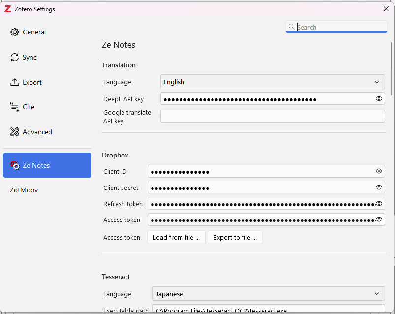
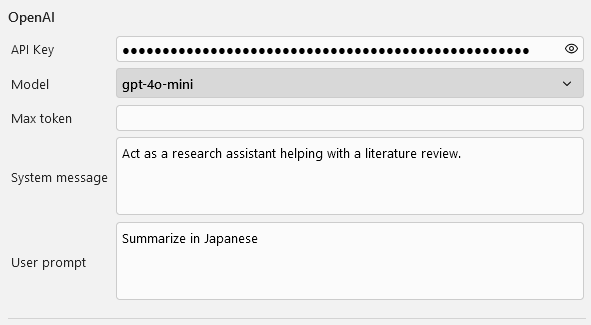
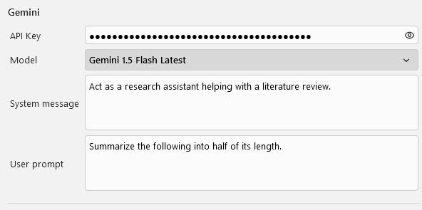
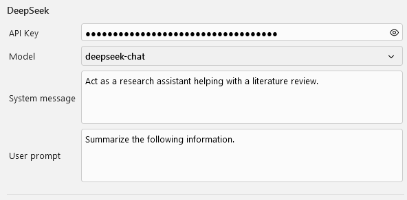
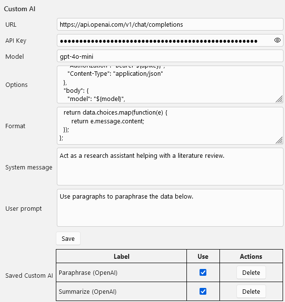
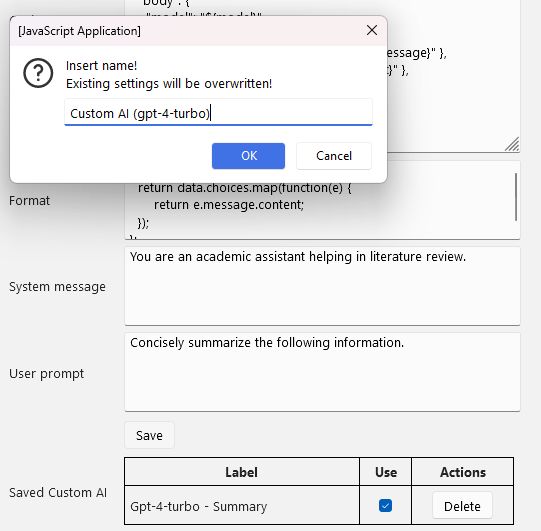
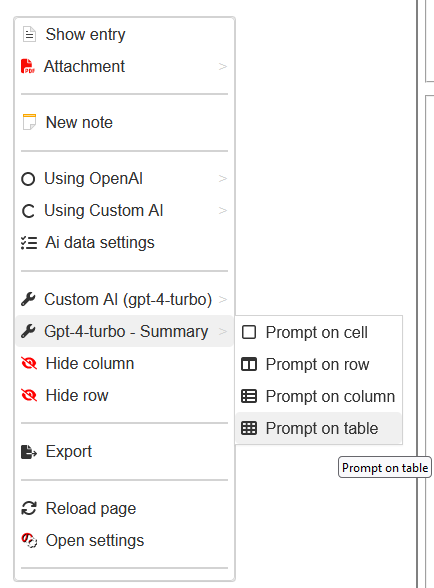
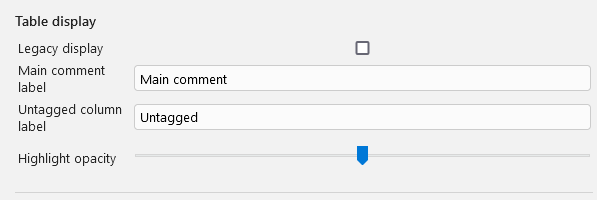
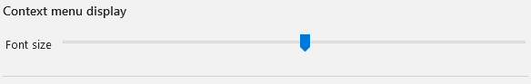

---

layout: default
title: "Ze Notes ドキュメント"

---

# Ze Notes ドキュメント

[English (original)](./index.md)

> **免責事項:** このページは AI によって英語版から翻訳されたものです。意味が不明瞭な場合や内容に確信が持てない場合は、英語の原文 [index.md](./index.md) を参照してください。

このページは、Zotero のノートと注釈を編集可能なテーブルとして表示するプラグイン Ze Notes の設定リファレンスです。インストールと主な機能の紹介については README から始めてください:
[https://github.com/frianasoa/Ze-Notes/blob/main/README-JA.md](https://github.com/frianasoa/Ze-Notes/blob/main/README-JA.md)

## 設定画面を開く

設定は「編集 → 設定」または「ツール → Ze Notes → Show settings」から開きます。同じウィンドウはテーブルの見出しコンテキストメニューからも開けます。



以下のセクションは設定ウィンドウの並び順に対応しています。

## Translation(翻訳)

| 項目 | 説明 |
|-------|-------------|
| Language | 翻訳先の言語 |
| DeepL API key | DeepL を使うために必要 |
| Google translate API key | 任意の Cloud Translation API キー |

Google 翻訳はキーなしで動作します。Cloud Translation API キーを指定すると Ze Notes はそれを使用し、指定がなければ無料エンドポイントにフォールバックします。DeepL はキーがないと動作しません。

翻訳先の言語を設定すると、「Translate with Google」と「Translate with DeepL」の操作がテーブルのコンテキストメニューと PDF リーダーに表示されます。

## Dropbox

Dropbox アプリを作成してその認証情報をここに入力すると、Dropbox のアップロード/ダウンロード操作が見出しコンテキストメニューに表示されます。入力が必要なのはクライアントIDとクライアントシークレット(および任意でリフレッシュトークン)だけで、残りの接続手順は Ze Notes が案内します。

| 項目 | 説明 |
|-------|-------------|
| Client ID | Dropbox アプリから取得 |
| Client secret | Dropbox アプリから取得 |
| Refresh token | 接続手順の中で自動入力 |
| Access token | 接続手順の中で自動入力 |

2つのボタンで、これらの設定を共同研究者と共有できます。

* **Export to file。** Dropbox 設定を暗号化ファイルとして保存します。エクスポート時にパスワードが生成されるので、ファイルとパスワードは別々に共同研究者へ送ってください。
* **Load from file。** 別の Ze Notes からエクスポートされたファイルを読み込みます。エクスポート時に生成されたパスワードが必要です。

接続が完了すると、テーブルの見出しコンテキストメニューに2つの操作が表示されます。

* **Upload to dropbox。** 現在のコレクションをノート・添付ファイル・注釈ごとエクスポートして zip 化し、ダイアログに入力したメールアドレスを名前とする Dropbox フォルダにアップロードします。ダイアログには添付ファイル数、合計サイズ、推定処理時間が表示され、エクスポート速度のスライダーで調整できます。
* **Download from dropbox。** 自分の Zotero アカウントのユーザー名を名前とするフォルダに共有されたファイルの一覧を、最終更新日とともに表示します。ファイルをダウンロードするとコレクションが Zotero にインポートされ(新規アイテムのみ追加)、インポートされた PDF 添付ファイルから注釈が更新されます。

## Tesseract

Tesseract は光学文字認識(OCR)のためのプログラムです。マシンにインストールされていれば、Ze Notes は注釈やノート内の画像をテキストに変換でき、注釈画像とノート画像のコンテキストメニューにOCRの操作が表示されます。

Tesseract のダウンロードは [https://tesseract-ocr.github.io/tessdoc/Downloads.html](https://tesseract-ocr.github.io/tessdoc/Downloads.html) を参照してください。

| 項目 | 説明 |
|-------|-------------|
| Language | 利用可能な言語リストから選ぶ認識言語 |
| Executable path | Tesseract をカスタムの場所にインストールした場合のみ必要(例: `C:\Program Files\Tesseract-OCR\tesseract.exe`)。Ze Notes は Windows、Linux、macOS の標準的な場所から実行ファイルを探します |
| Correction AI Model | 任意。OCR の出力を設定済みのAIプロバイダに通し、テキストの言語と構造を保ったまま認識エラーを修正します |


## Generative AI(生成AI)

以下のサービス情報を設定すると、Ze Notes は OpenAI、Gemini、DeepSeek、Claude のAIプロンプトを実行できます。各プロバイダの操作は、API キーを設定するとテーブルのコンテキストメニューに表示され、セル、行、列、テーブル全体、またはセル内の選択部分に対してプロンプトを実行できます。ノートと注釈に対しては、ノート、注釈コメント、注釈引用、またはそれらの選択部分を対象にすることもできます。

各プロバイダにはシステムメッセージとユーザープロンプトを設定します。システムメッセージはアシスタントの役割を、ユーザープロンプトはテーブルから送られるデータをどう処理するかを記述します。満足のいく結果になるまで両方を調整してください。

コンテキストメニューのAI操作の隣にある「Ai data settings」を開くと、プロンプトとともに送信するデータの範囲を選ぶダイアログが表示されます: 引用、出典、著者、および個々のタグ・注釈パートで、「Check all」で一括切り替えできます。選択内容はコレクションごとに保存されます。

APIキーはお使いのマシン上で暗号化して保存されます。利用料金はプロバイダから請求されるため、プロバイダのダッシュボードを確認してください。

### OpenAI

項目: API key、model、max token、system message、user prompt。



### Gemini

項目: API key、model、system message、user prompt。



### DeepSeek

項目: API key、model、system message、user prompt。



### Claude

項目: API key、model、max token、system message、user prompt。設定方法は OpenAI と同じです。

## Custom AI

上記以外のプロバイダに対してプロンプトを実行したり、同じプロバイダに対して複数の定型プロンプトを用意したりすることもできます。Custom AI 設定でリクエスト自体を記述します。

*Custom AI 設定*


URL、APIキー、モデルを入力します。これらの値はリクエスト内で変数として使われます。次に、リクエストとともに送信するオプションを組み立て、API から返されたデータを整形する関数を追加します。この関数はリストを返す必要があります。現時点では、リストの最初の要素のみが実行時にメインテーブルへ追加されます。

「System message」と「User prompt」には汎用的なデフォルト値が入っていますが、自分で記入してもかまいません。

options の動作するサンプル値は次のとおりです。

*options のサンプル*
```
{
  "method": "POST",
  "headers": {
    "Authorization": "Bearer ${apikey}",
    "Content-Type": "application/json"
  },
  "body": {
    "model": "${model}",
    "messages": [
      { "role": "system", "content": "${systemmessage}" },
      { "role": "user", "content": "${userprompt}" },
      { "role": "user", "content": "${data}" }
    ]
  }
}
```

`${variable}` プレースホルダに注目してください。リクエスト送信時に設定値で置き換えられます: `${apikey}`、`${model}`、`${systemmessage}`、`${userprompt}` は上記の項目から、`${data}` はテーブルから送られる内容です。お使いの API に合わせて構造を調整してください。

*整形関数*
```
(data) => {
  return data.choices.map(function(e) {
      return e.message.content;
  });
};
```

これらの値を設定すると、メインテーブルのコンテキストメニューに「Using Custom AI」操作が表示されます。実行してみて、満足のいく結果になるまでシステムメッセージとユーザープロンプトを調整してください。納得できたら、保存をクリックして現在の設定に名前を付けて記録します。どのモデルを使ったか把握できるよう、名前にはモデル名を含めてください。プロバイダによっては高額なモデルもあります。また、長い名前はメニューを乱すことがあるので短い名前を推奨します。

*Custom AI API 呼び出しの記録方法*


「OK」をクリックすると、現在の Custom AI 設定が記録され、「Saved Custom AI」に表示されます。メインテーブルのコンテキストメニューに表示したいものには「Use」にチェックを入れ、使わないものはチェックを外してメニューが混雑しないようにしてください。同時に表示されるのは最大20件です。

下の画像は、設定がメインテーブルのコンテキストメニューにどう反映されるかを示しています。

*Custom AI を反映したコンテキストメニュー*


## Table display(テーブル表示)

| 項目 | 説明 |
|-------|-------------|
| Legacy display | フィールドセットなしの、バージョン0に近いテーブルを表示する |
| Hide note/annotation icons | テーブルからノートと注釈のアイコンを取り除く |
| Main comment label | メインコメントに使うラベル |
| Untagged column label | タグのないノートと注釈をまとめる列のラベル(デフォルトは「Untagged」) |
| Highlight opacity | ハイライトされた引用の背景の不透明度 |
| Notes background color | ノートの背景色 |
| Show column sorter | 非表示の列がないときも列ソーターを表示しておく。タグが多いときに便利 |
| Column prefix | 各列見出しの前に付けるテキスト |
| Column suffix | 各列見出しの後に付けるテキスト |
| Allow duplicate rows | 同じ行を複数回表示できるようにする |



## Context menu display(コンテキストメニュー表示)

コンテキストメニューのフォントサイズを設定できます。



## Export(エクスポート)

見出しまたはセルのコンテキストメニューから「Export」を選びます。2つのタブを持つダイアログが開きます。

* **Select data。** 含める要素を選びます: 引用、出典、著者、および個々のタグ・注釈パート。「Check all」で一括切り替えできます。
* **Advanced settings。** td スタイル、ハイライト、アイコン、メイン/サブの凡例の削除、空要素の除外、エクスポートファイルの隣にリンクされたリソース用の保存フォルダを作成するかどうかを設定します。

「Export」をクリックしてファイル名を指定します。拡張子が形式を決めます: `.html`/`.xhtml`、`.md`、`.xlsx`、`.xls`、`.docx`。エクスポートが完了するとファイルが開き、選択内容はコレクションごとに記憶されます。

## コンテキストメニュー

テーブルのほとんどの操作は2つのコンテキストメニューから実行します。

**セルのコンテキストメニュー**(セルを右クリック):

* エントリの表示、注釈の表示、添付ファイル(PDF、HTML、画像)を開く
* ノートまたは注釈コメントの編集、新しいノートの作成、ノートの削除
* Google または DeepL での翻訳
* AIプロンプトの実行と「Ai data settings」ダイアログ
* 注釈画像とノート画像のOCR
* エクスポート、列または行の非表示、ページの再読み込み、設定を開く

**見出しのコンテキストメニュー**(列見出しを右クリック):

* **Filter data。** すべて表示、タグ付きのみ表示、タグなしのみ表示。
* **Show columns / Show rows / Hide column。** 非表示にした列や行を戻す、現在の列を非表示にする。
* **Table sort ... / Column sort ...** 後述の並べ替えダイアログを開く。
* **Reset default widths。** 元の列幅に戻す。
* エクスポート、Dropbox のアップロード/ダウンロード、ページ内検索、ページの再読み込み、設定を開く。

## 操作

* **列のリサイズ。** 列の右端にカーソルを合わせてサイズを変更します。
* **列の一括リサイズ。** 列見出しの右端にカーソルを合わせると、すべての列をまとめてリサイズできます。
* **列の並べ替え。** 列見出しをドラッグ&ドロップして並べ替えられます。「見出しを右クリック → Column sort ...」でも同じことができます: ダイアログが開き、要素をドラッグするか矢印で移動できます。目のアイコンをクリックすると列の表示/非表示を切り替えられます。「Show all」と「Hide all」ボタンは全列に一括で適用されます。
* **テーブルの並べ替え。** 「見出しを右クリック → Table sort ...」。一番上の要素が第1ソートキー、一番下が最後のソートキーになります。要素をドラッグして順序を変更できます。ソートアイコンをクリックすると並び順が反転し、アイコンが赤いときはその要素の反転ソートが有効です。

## ショートカット

| ショートカット | 操作 |
|----------|--------|
| Ctrl+F | 検索バーを開く |
| Enter / F3 | 次の一致へ |
| Shift+Enter / Shift+F3 | 前の一致へ |
| Escape | 検索バーを閉じる |
| Ctrl+Plus | ズームイン |
| Ctrl+Minus | ズームアウト |
