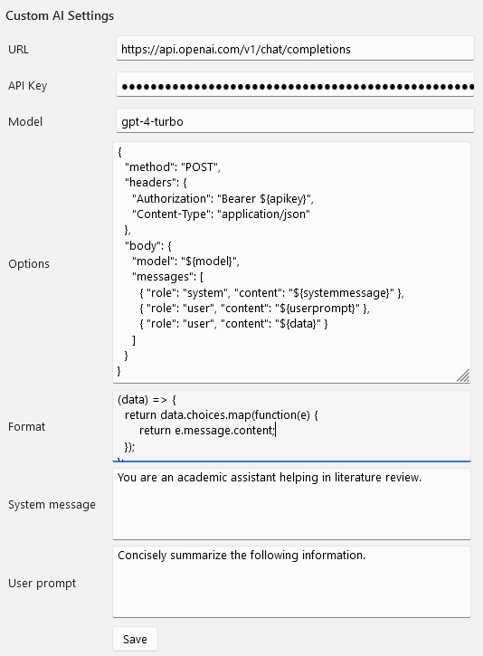
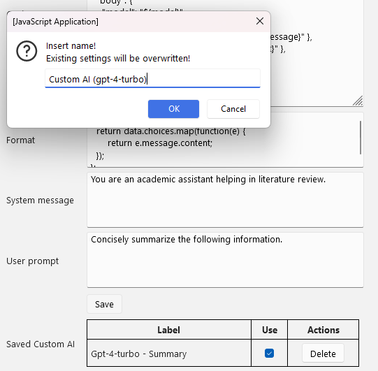
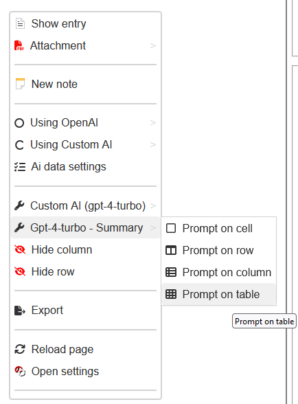

---

layout: default
title: "Ze-Notes version 1 documentation"

---

## Ze Notes version 1 beta

Contents will be added later. See below for version 0 README.MD \
https://github.com/frianasoa/Ze-Notes/blob/v0/README.md \

For current version README.MD:\
https://github.com/frianasoa/Ze-Notes/blob/v1/README.md

# Settings
## Custom AI Settings 
You can have several Custom AI requests that can be called on different parts of your data (table, row, column, cell, annotations, notes, note parts, etc.). The image below shows how to set one up.

*Custom AI Settings*


Fill in the URL, the API key, and the model. Those variables are used in the request later. Construct the options variable to be sent with the request. Also, add a function to format the data from the API. The function should return a list. For now, only the first element of such a list is added to the main table upon execution.

"System message" and "User prompt" have generic default values but you can go ahead and fill them too.

Here is a working sample value for options.

*Options sample*
```
{
  "method": "POST",
  "headers": {
    "Authorization": "Bearer ${apikey}",
    "Content-Type": "application/json"
  },
  "body": {
    "model": "${model}",
    "messages": [
      { "role": "system", "content": "${systemmessage}" },
      { "role": "user", "content": "${userprompt}" },
      { "role": "user", "content": "${data}" }
    ]
  }
}
```

Please see how the variables are included and adapt to your API. 

*Format function*
```
(data) => {
  return data.choices.map(function(e) {
      return e.message.content;
  });
};
```

After setting those values, you will see "Using Custom Ai" in the context menu. Try and adjust the "System message" and the "User prompt" untill you are satisfied with the results. Once you are satisfied, you may click save to record the current settings. 

*How to record a Custom AI API call*


Once you click "OK", the current Custom AI settings will be recorded and will show in "Saved Custom AI". You can add as many Custom AI menu as you want. However, avoid long names that could disrupt the menu.

Check "Use" if you want it to show in the context menu of the main table. Uncheck "Use" for the ones you do not use to avoid an overcrowded menu. 

The image below shows how the settings are reflected on the context menu of the main table.

*Context menu reflecting Custom AI*
