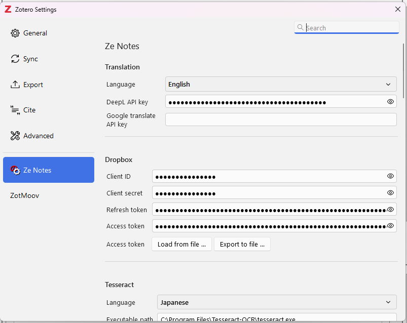
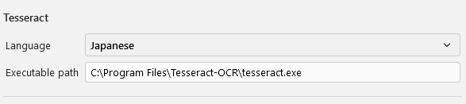
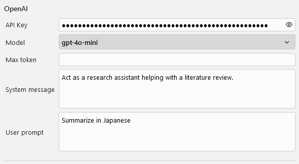
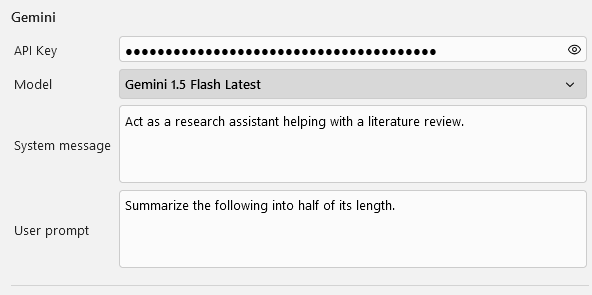
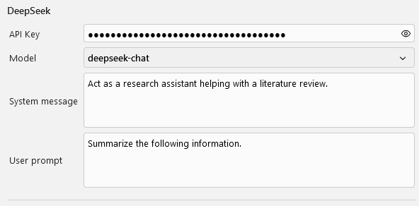
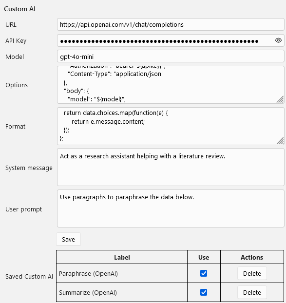
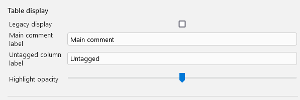

---

layout: default
title: "Ze-Notes version 1 documentation"

---

## Get started
Please see README.md to get started
[https://github.com/frianasoa/Ze-Notes/blob/main/README.md](https://github.com/frianasoa/Ze-Notes/blob/main/README.md)  

For the previous version of README.md:  
[https://github.com/frianasoa/Ze-Notes/blob/v0/README.md](https://github.com/frianasoa/Ze-Notes/blob/v0/README.md)

# Settings
## General settings
You can show the following settings by going to "Edit -> Settings" or "Tools -> Ze Notes -> Show settings"


## Translation
You set the variables related to translation in order to show the action on context menu. Set the target language and the API keys. See the section on API keys (I will add this later but for now, Google is your friend).

## Dropbox
You have Dropbox related menu in heading context menu if you add information related to Dropbox. See the section on API (For now just Google how to make a Dropbox app in order to get client ID, API keys, etc). You only need to provide the first two (or three) values. Ze Notes will guide you through the process of setting up.
  * With the "Export to file" button, you may export your Dropbox settings and send it to your co-researchers. You will need to send them the password provided as well. 
  * With the "Load from file" button, you may load data exported from Ze Notes settings of Dropbox. You will need the password that was generated when exporting. 

## Tesseract
Tesseract is a program that allows Optical Character Recognition (OCR). If you install Tesseract on your machine, Ze Notes will look for its path and use it to turn Images to text. You may also add a custom link if Tesseract is installed to a custom path. A menu will be added to the context menu. You may also choose from the languages available. 


Do downnload Tesseract, please check the link below.
https://tesseract-ocr.github.io/tessdoc/Downloads.html

## Generative AI settings
Ze Note can run prompt from Open AI, Gemini, and DeepSeek if information on the service are provided. Menu will be available from the context menu. You may run them on cell, row, column, table or parts of the cell. Just provide the settings, add system message and user prompt.

Please see the screenshot below. You may refer to the section about API keys for more information (Coming soon. For now, Google is your friend).

### Open AI


### Gemini


### DeepSeek



## Custom AI Settings
You may also run custom AI prompt if you have providers other than the default above. You may also set different ready to use prompts for the same provider. The image below shows how to set up OpenAI.

*Custom AI Settings*


Fill in the URL, the API key, and the model. Those variables are used in the request later. Construct the options variable to be sent with the request. Also, add a function to format the data from the API. The function should return a list. For now, only the first element of such a list is added to the main table upon execution.

"System message" and "User prompt" have generic default values but you can go ahead and fill them too.

Here is a working sample value for options.

*Options sample*
```
{
  "method": "POST",
  "headers": {
    "Authorization": "Bearer ${apikey}",
    "Content-Type": "application/json"
  },
  "body": {
    "model": "${model}",
    "messages": [
      { "role": "system", "content": "${systemmessage}" },
      { "role": "user", "content": "${userprompt}" },
      { "role": "user", "content": "${data}" }
    ]
  }
}
```

Please note $\{variable\}. You may use them in your input. Please see how they are included and adapt to your API. 

*Format function*
```
(data) => {
  return data.choices.map(function(e) {
      return e.message.content;
  });
};
```

After setting those values, you will see "Using Custom Ai" in the context menu. Try and adjust the "System message" and the "User prompt" untill you are satisfied with the results. Once you are satisfied, you may click save to record the current settings. Do not forget to keep the model in the name to keep track of the models you use (some are expensive depending on the provider).

*How to record a Custom AI API call*


Once you click "OK", the current Custom AI settings will be recorded and will show in "Saved Custom AI". You can add as many Custom AI menu as you want. However, avoid long names that could disrupt the menu (I should fix this but no time for now).

Check "Use" if you want it to show the custom menu in the context menu of the main table. Uncheck "Use" for the ones you do not use to avoid an overcrowded menu. 

The image below shows how the settings are reflected on the context menu of the main table.

*Context menu reflecting Custom AI*


## Other menu
* Legacy display will show a table similar to version 0, without the fieldset.
* Other items are self-evident. Please try them.
### Table display


### Context menu display
Here you can set the size of the context menu.


## Actions and shortcuts
### Actions
* Column resize: Place your cursor on the right border of a column to resize the column.
* Column batch resize: Place your cursor on the right border of a column heading to resize all the columns.
* Rearrange columns: You may drag and drop column headers to rearrange the columns. You may do the same with "right click on heading -> Column sort ..." A dialog box will show. Drag-drop the elements around. You may also use the arrows to move them. Click on the eye icon to hide/show the column.
* Sort table: "Right click on heading -> Table sort ..." The top most element will be the first sort key. The bottom most will be the last sort key. You may Drag-drop the elements around. Click the sort icon to reverse the sorting. Red icon means activated = reverse sorting for the corresponding element.

### Shortcuts
* CTRL + Zoom in
* CTRL - Zoom out
* CTRL F Find